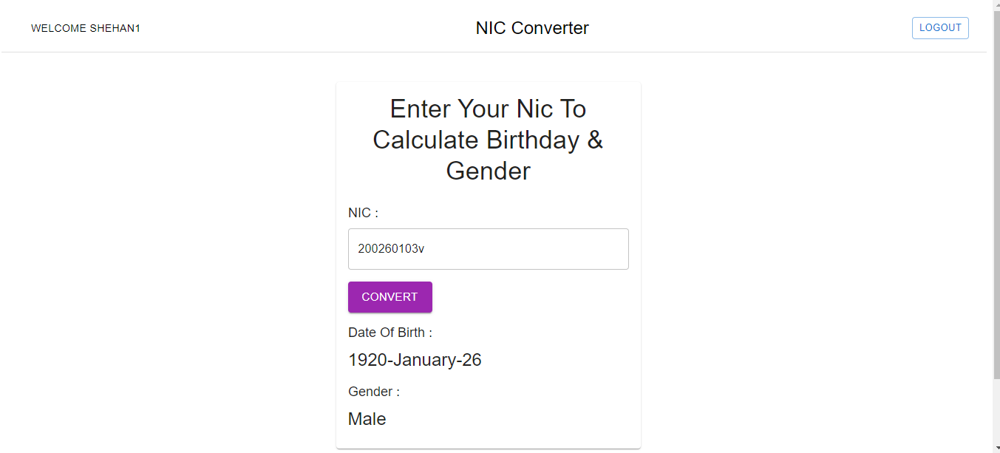

# nic_calculator_task

This Repository includes Nic calculator task

# Find Birthday, Gender from NIC number

This Web application is created fro finding Date Of Birth and Gender of Sri lanka citizen using their NIC card No.
This supports the all new and old NIC card Numbers.

# Technologies used-Frontend

React js
Formik & Yup for form validation
Axios

# Technologies used Backend

Nodejs
ExpressJs
JsonWebToken -Jwt

# How To Run

# Frontend

cd client folder & run `npm install`
`npm start`

# Backend

cd server folder & run `npm install`
create .env file in server folder
add CONNECTION_STRING - MongoDB Connection String, SECRET - secret key for token generate
`npm start`
